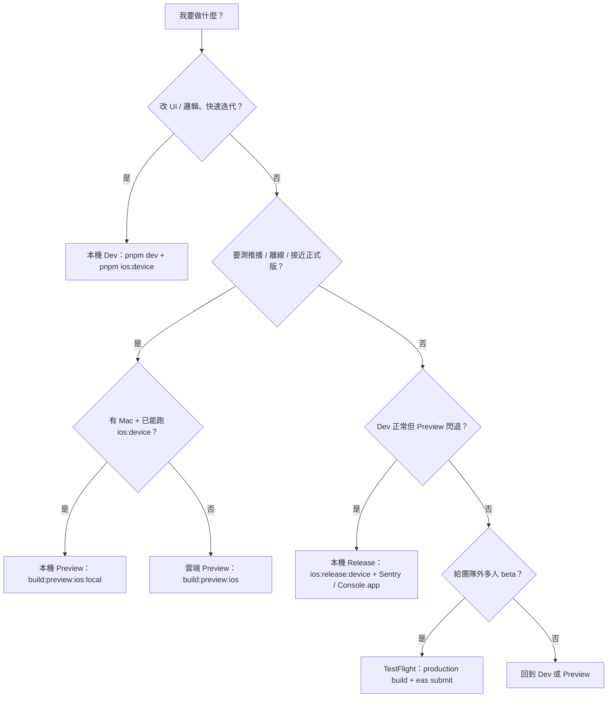
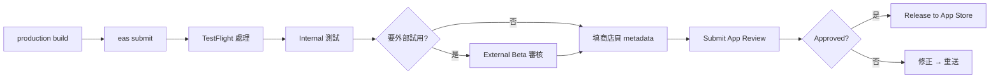

# Mobile app 建置與發佈（Expo / EAS）

t42-starter monorepo 中 **Expo / EAS mobile app**（`apps/<slug>`）的 **日常開發**、**真機測試**、**內部分發**、**TestFlight**、**App Store 正式上架** 流程與指令。

- `<slug>`：app 目錄名；npm package 通常為 `@t42/<slug>`
- 各 app 的 Bundle ID、EAS project、產品規格：見 `apps/<slug>/app.json`、`eas.json`、`docs/specification/<slug>/`
- Web app 部署見 [`deployment.md`](./deployment.md)

腳本說明以本文件為準（`package.json` 為標準 JSON，無法寫註解）。

---

## 1. 先建立心智模型

iOS app 有兩層：

```
┌─────────────────────────────────────┐
│  JavaScript / React（業務邏輯、UI）   │  ← apps/<slug> 程式碼
├─────────────────────────────────────┤
│  Native Shell（iOS 原生外殼）         │  ← 需編譯 + Apple 簽名才能裝到 iPhone
└─────────────────────────────────────┘
```

iPhone **不會**直接執行 `.tsx` 檔。一定要有一個已簽名的 native app（`.ipa` / `.app`），裡面再載入 JS。

另外要分清楚 **Debug vs Release**（跟「有沒有 Metro」是兩個維度）：

| 維度 | Debug | Release |
|------|-------|---------|
| JS 最佳化 | 少 | 有（接近上架版） |
| 錯誤顯示 | RedBox / Metro log | 常直接閃退，無紅屏 |
| 典型用途 | 日常開發 | EAS Preview、TestFlight、除錯「dev 正常但 preview 閃退」 |

| 維度 | 有 Metro（Dev Client） | JS 已打包（Standalone） |
|------|------------------------|-------------------------|
| JS 從哪來 | Mac 上的 Metro | 建置時 embed 進 app |
| 需要電腦開著 | 是（同 Wi‑Fi 或 tunnel） | 否 |
| 典型用途 | 改 UI、快速迭代 | 推播、離線、給別人裝 |

**EAS Preview ≈ Release + JS 已打包 + Ad Hoc 簽名。**  
本機 `pnpm ios:release:device` ≈ Release + JS 已打包 + Development 簽名（行為接近 Preview，簽名方式不同）。

---

## 2. 各角色分工

| 角色 | 做什麼 | 你在哪裡看 |
|------|--------|------------|
| **你（開發者）** | 寫程式、跑指令 | 本機 terminal、Cursor |
| **Expo / EAS** | 雲端或本機編譯、管理 Apple 憑證副本、提供 build 紀錄 | [expo.dev](https://expo.dev) → 你的 account / project |
| **Apple Developer** | App ID、Push、憑證、Provisioning Profile 的**權威來源** | [developer.apple.com](https://developer.apple.com/account) |
| **TestFlight / App Store** | Beta 與正式上架管道 | [appstoreconnect.apple.com](https://appstoreconnect.apple.com) |

EAS **不取代**你的 Apple 帳號。EAS 是在你授權後，代為在 Apple 建立 App ID（`app.json` 的 `bundleIdentifier`）、依需要啟用 Push、產生 Provisioning Profile，並在 Expo 面板顯示 build 狀態。

---

## 3. 怎麼選？（使用時機決策）

先問自己現在要驗什麼：



### 3.1 模擬器 vs 真機

| | iOS 模擬器 | iPhone 真機 |
|---|:---:|:---:|
| **使用時機** | 排版、導航、表單、SQLite、日常 UI | 推播、效能手感、Release 行為、上架前最後確認 |
| **指令** | `pnpm ios` | `pnpm ios:device` |
| **推播** | 不可靠 | 必須用真機 |
| **建議** | 日常 80% 迭代 | 推播、硬體、Release 行為必測 |

社群慣例：**模擬器求快，真機求準**；兩者都用，不是二選一。

### 3.2 建置模式一覽

| 模式 | 指令 | 建置 | JS | Metro | **使用時機** | **不要用在** |
|------|------|------|-----|:-----:|--------------|-------------|
| **本機 Dev（模擬器）** | `pnpm dev` + `pnpm ios` | Debug | Metro | ✅ | 改 UI、除錯 JS、最快 feedback | 推播、Release 問題 |
| **本機 Dev（真機）** | `pnpm dev` + `pnpm ios:device` | Debug | Metro | ✅ | 真機上手勢、Safe Area、日常開發 | 驗證 EAS Preview 是否會閃退 |
| **本機 Release（真機）** | `pnpm ios:release:device` | Release | 已打包 | ❌ | **Preview 閃退時最快重現**；驗證 embed bundle | 日常改 UI；驗證 Ad Hoc 簽名 |
| **EAS Preview（本機）** ⭐ | `pnpm build:preview:ios:local` | Release | 已打包 | ❌ | **Mac 首選**：Ad Hoc `.ipa`，免雲端排隊 | 沒有 Mac / Xcode |
| **EAS Preview（雲端）** | `pnpm build:preview:ios` | Release | 已打包 | ❌ | 無 Mac、或交叉驗證 EAS 環境 | 日常迭代（要排隊） |
| **EAS Dev Client** | `pnpm build:dev:ios` | Debug shell | Metro | ✅ | 不想本機編譯 Xcode，只要 dev client | 驗證 Release 行為 |
| **TestFlight** | `production` build + `eas submit` | Release | 已打包 | ❌ | 多人 beta、上架前最後一輪 | 日常開發 |

⭐ **有 Mac 且 `pnpm ios:device` 已成功過**：Preview 類驗證優先 `build:preview:ios:local`，不必每次等雲端隊伍。

### 3.3 Mac 本機 build：要開 Xcode 嗎？

**通常不用開 Xcode.app。** Terminal 跑指令即可；EAS / Expo 會在背景呼叫 `xcodebuild`。

| 問題 | 答案 |
|------|------|
| 需要 Mac 嗎？ | 是（本機 iOS build） |
| 需要安裝 Xcode 嗎？ | 是；但若 `pnpm ios:device` 已成功，代表已就緒 |
| 需要會用 Xcode GUI 嗎？ | **否**；除錯看 Console.app 或 Sentry 即可 |
| 本機 vs 雲端 Preview | **同一個 `preview` profile**（Ad Hoc + Release）；差在編譯位置與是否排隊 |
| 第一次 local build 多久？ | 約 10–20 分鐘（prebuild + pod + 編譯）；之後增量較快 |
| 比 `ios:release:device` 慢？ | 是；但產出 **Ad Hoc `.ipa`**，與雲端 Preview 簽名一致 |

快速自檢（可選）：

```bash
xcode-select -p
xcodebuild -version    # SDK 57 建議 Xcode ≥ 16
```

### 3.4 常見誤判

| 現象 | 代表什麼 | 下一步 |
|------|----------|--------|
| `pnpm dev` + `pnpm ios:device` 正常 | JS / UI 邏輯大致 OK | 若 Preview 仍閃退 → 查 Release 路徑 |
| EAS Preview 一開就閃退 | Release 或 native 設定問題 | ① `pnpm ios:release:device` ② Sentry Issues ③ Console.app |
| 每次雲端 Preview 都要排隊 | 有 Mac 可改走本機 | `pnpm build:preview:ios:local` |
| 升級 Expo SDK 後舊 ipa 不能用 | Dev client / native 與 JS 版本綁定 | 重跑 `pnpm ios:device` 或新 Preview build |
| 模擬器 OK、真機 Preview 閃退 | 以真機 Release 為準 | 不要只在模擬器 Dev 模式下結案 |

---

## 4. 專案識別（從設定檔讀取）

每個 mobile app 在 repo 內有獨立識別；**不要**把 monorepo 框架名 `otto` 當作 App Store / Bundle ID 對外品牌。

| 項目 | 哪裡看 |
|------|--------|
| 目錄 | `apps/<slug>/` |
| Monorepo package | `apps/<slug>/package.json` → `name`（通常 `@t42/<slug>`） |
| App 顯示名稱 | `app.json` → `expo.name`（有 variants 時由 `app.config.js` + `APP_VARIANT` 覆寫） |
| iOS Bundle ID | `app.json` → `expo.ios.bundleIdentifier`（variants：見下） |
| Android package | `app.json` → `expo.android.package`（variants：見下） |
| EAS slug / project | `app.json` → `expo.slug`；面板 `https://expo.dev/accounts/<owner>/projects/<slug>` |
| Expo SDK | `apps/<slug>/package.json` → `expo` 版本；catalog 見根目錄 `pnpm-workspace.yaml` |
| iOS 最低版本 | `app.json` → `expo.ios.deploymentTarget`（SDK 57 通常 **16.4**） |

產品規格與 app 專屬 checklist：`docs/specification/<slug>/`。

### App variants（建議：可並存於同一裝置）

用 `APP_VARIANT`（`eas.json` profile env + 本機 scripts）區分身分，範例（mobile）：

| Variant | Bundle / package | 用途 |
|---------|------------------|------|
| `development` | `….<slug>.dev` | Dev Client + Metro |
| `preview` | `….<slug>.preview` | Ad Hoc 內測 |
| `production` | `….<slug>` | Store / TestFlight |

詳見該 app 的 `app.config.js` 與 `docs/specification/<slug>/infra.md`。

---

## 5. 日常開發（Debug + Metro）

**使用時機**：改 `.tsx`、調 UI、修 business logic、跑 typecheck/test 以外的 smoke test。

**不適用**：驗證推播排程、Preview 閃退、離線 bundle、Ad Hoc 分發。

### 5.1 第一次（或 SDK / native 依賴變更後）

```bash
cd apps/<slug>
pnpm install   # 若尚未在 repo 根目錄跑過 pnpm install
pnpm ios:device          # 真機；模擬器改用 pnpm ios
```

首次會 prebuild 產生 `ios/`、跑 CocoaPods、Xcode 編譯（約 5–15 分鐘）。  
SDK 57 需要 `ios.deploymentTarget: "16.4"`，否則 `pod install` 可能失敗。

### 5.2 每次改 JS（大部分時間）

Terminal 1 — Metro：

```bash
cd apps/<slug>
pnpm dev
```

Terminal 2 — 僅在 **首次** 或 **native 變更** 時才需要再跑 `pnpm ios:device`。  
之後只改 TS/TSX：存檔 → Metro hot reload，**不必**重編譯 native。

### 5.3 提交前

```bash
pnpm --filter @t42/<slug> typecheck
pnpm --filter @t42/<slug> test
pnpm --filter @t42/<slug> doctor    # expo-doctor
```

Pre-commit 會跑**全 monorepo** typecheck；`main` 分支須保持通過。

### 5.4 Dev 模式除錯

- **JS 錯誤**：Metro terminal 紅字、手機 RedBox
- **Native 警告**（如 `onAnimatedValueUpdate`）：通常可忽略，除非伴隨功能異常

---

## 6. 本機 Release 直裝（Preview 除錯用）

**使用時機**：

- EAS Preview 安裝後**一開就閃退**，但 Dev 模式正常
- 想在不上傳 EAS 的情況下，驗證 **JS 已打包 + Release 最佳化** 的啟動路徑
- 比 EAS Preview 迭代快（不用等雲端隊伍），但**簽名仍是 Development**，與 Ad Hoc Preview 不完全相同

**不適用**：

- 日常改 UI（太慢，每次都要 bundle + 編譯）
- 代替 Ad Hoc `.ipa` 分發（請用 `build:preview:ios:local` 或雲端 Preview）
- 驗證 Ad Hoc 憑證 / Push 在 Ad Hoc profile 下的行為（仍應跑本機或雲端 Preview）

```bash
cd apps/<slug>
pnpm ios:release:device     # 真機 + Release；不需 pnpm dev
# 模擬器：pnpm ios:release
```

Release **沒有 RedBox**。若閃退，依序：

1. 到 Sentry Issues（`https://<org>.sentry.io/issues/?project=<project>`，見 §15；native crash 有時需**再開一次 app** 才上報）
2. iPhone USB 連 Mac → **Console.app** → 篩選 `<slug>` 或 `<bundleIdentifier>` → 複製 crash 前後 log

---

## 7. 真機測試與分發（JS 已打包）

**使用時機**：推播、離線使用、確認 embed bundle、給特定 iPhone 裝 Ad Hoc 版。

### 7.1 EAS Preview（本機）— Mac 首選 ⭐

```bash
cd apps/<slug>
pnpm build:preview:ios:local
```

**使用時機**：

- 與雲端 Preview **相同 profile**（Ad Hoc + Release + JS 已打包）
- **免雲端排隊**；適合有 Mac、已能跑 `ios:device` 的開發者
- 產出 Ad Hoc `.ipa` 在本機；憑證仍用 EAS 已儲存的 Ad Hoc 設定

**前置**：

- Mac + Xcode 已安裝（不必開 Xcode.app）
- 若需 Sentry source map：本機 `apps/<slug>/.env.local` 含 `SENTRY_*`（見 §15）
- 首次約 10–20 分鐘；之後增量 build 較快

Build 完成後依終端機指示安裝 `.ipa`（或透過 EAS 上傳後取得連結）。

### 7.2 EAS Preview（雲端）— 備用

```bash
cd apps/<slug>
pnpm build:preview:ios
```

**使用時機**：

- **沒有 Mac** 或本機 local build 失敗時
- 需要 Expo 面板上的 **安裝連結 / QR** 直接分享
- 交叉驗證「EAS 雲端環境」與本機結果是否一致

**代價**：可能需 **排隊** 數分鐘到數十分鐘。

首次會問 Apple 帳號、2FA、是否讓 EAS 管理憑證——選 **Yes**。建議選項：

- **Encryption**：`Y`（僅標準加密）
- **Provider**：你的 Apple Developer Team 名稱（與 Developer Team 一致）
- **Distribution certificate**：`Y` 重用既有
- **Push Notifications**：`Yes`

Build 成功後，終端機或 [Expo 面板](https://expo.dev)（你的 project → Builds）會給 **安裝連結 / QR**。

### 7.3 本機 vs 雲端 Preview

| | 本機 `build:preview:ios:local` | 雲端 `build:preview:ios` |
|---|:---:|:---:|
| Profile | `preview`（Ad Hoc） | 同左 |
| 排隊 | 無 | 可能有 |
| 需要 Mac | 是 | 否 |
| 需要開 Xcode GUI | 否 | 否 |
| 安裝方式 | 本機 `.ipa` / 終端指示 | QR / 連結（較方便分享） |
| **建議** | **日常 Preview 驗證首選** | 偶爾交叉驗證或無 Mac 時 |

### 7.4 Preview vs TestFlight

| | EAS Preview（Ad Hoc） | TestFlight |
|---|:---:|:---:|
| 安裝方式 | EAS 提供的連結 / QR | TestFlight app |
| 裝置限制 | 須事先在 Apple 登記 UDID | Internal：團隊 ≤100 人；External：邀請制 |
| Apple 審核 | 無 | Internal 通常無；External 要 Beta 審核 |
| **使用時機** | 自己 + 少數已登記裝置 | 給多人、非 UDID 白名單 |

---

## 8. EAS build profiles

定義於 `apps/<slug>/eas.json`：

| Profile | 用途 | 指令 | 使用時機 |
|---------|------|------|----------|
| `development` | Dev Client shell | `pnpm build:dev:ios` | 不想本機跑 Xcode，但要 Metro dev |
| `preview` | Ad Hoc，JS 已打包 | `build:preview:ios:local`（Mac）或 `build:preview:ios`（雲端） | **真機推播、離線、內部分發** |
| `production` | App Store / TestFlight | `eas build --profile production --platform ios` | 上架、TestFlight |

---

## 9. 指令速查（`apps/<slug>`）

所有 script 定義在 `apps/<slug>/package.json`；**使用時機**見下表。以下指令皆在 `apps/<slug>` 目錄執行（或 `pnpm --filter @t42/<slug> <script>`）。

| 指令 | 使用時機 |
|------|----------|
| `pnpm dev` | 啟動 Metro；搭配 Dev Client 日常開發 |
| `pnpm ios` | 本機 **Debug** 編譯 → **模擬器**（首次或 native 變更） |
| `pnpm ios:device` | 本機 **Debug** 編譯 → **真機**（日常開發首選） |
| `pnpm ios:release` | 本機 **Release** → 模擬器（除錯 embed bundle） |
| `pnpm ios:release:device` | 本機 **Release** → 真機（**Preview 閃退最快重現**） |
| `pnpm build:preview:ios:local` | EAS 本機 Ad Hoc（**Mac Preview 首選**，免排隊） |
| `pnpm build:preview:ios` | EAS 雲端 Ad Hoc（無 Mac 或交叉驗證） |
| `pnpm build:preview:android` | EAS 雲端 Android preview |
| `pnpm build:dev:ios` | EAS 雲端 Dev Client |
| `pnpm build:production:ios` | EAS **production** build（TestFlight / App Store） |
| `pnpm submit:ios` | 上傳 production build 到 App Store Connect |
| `pnpm doctor` | 依賴與 Expo 設定健康檢查 |
| `eas credentials` | 查看 / 管理 Apple 憑證 |
| `eas submit --platform ios --latest` | 提交最近一次 production build（免手選 build id） |

---

## 10. Apple 前置（一次性）

1. [developer.apple.com](https://developer.apple.com/account) 同意 **Program License Agreement（PLA）**
2. 付費 **Apple Developer Program**（Push Notifications 需要）
3. 首次 EAS build 時讓 EAS 建立 `app.json` 中的 **Bundle ID**，並依 app 需要啟用 Push 等 capabilities

若本機 `pnpm ios:device` 出現 Push / Provisioning Profile 錯誤，**真機分發仍可用 EAS Preview**；日常 Dev 則用 Development 簽名即可。

---

## 11. 建置時注意（monorepo）

- EAS 在 repo **根目錄**跑 `pnpm install`（整個 workspace）。
- `eas.json` 的 Node 版本須符合 workspace 依賴（目前 `22.14.0`）。
- `eas-build-post-install` 會編譯 `@t42/observability`（dist-first package）。
- `ios/`、`android/` 為 prebuild 產物，已在 `.gitignore`；EAS 在雲端重新 prebuild。
- 升級 **Expo SDK major** 後：重跑 `pnpm ios:device`（dev client）與 `pnpm build:preview:ios:local`（preview），舊 ipa **不能**載入新 JS。
- 本機 EAS local build 會讀 `apps/<slug>/.env.local`（Sentry 等）；雲端 build 讀 EAS Environment Variables（見 §15.3）。

---

## 12. 推播測試 checklist

**使用時機**：改完推播、提醒或通知相關功能後，在 **本機或雲端 Preview**（或至少 **本機 Release 真機**）上驗證。

1. 在 iPhone **設定 → \<App 顯示名稱\> → 通知** 允許通知
2. App 內完成 onboarding / 允許通知權限
3. 新增一個 **幾分鐘後** 的提醒項目
4. 將 app **切到背景或滑掉**
5. 確認推播出現；點擊進 app 完成紀錄或略過

模擬器對推播支援有限；**Dev + Metro 也無法完全代表 Preview 的推播行為**。

---

## 13. 建議演進路徑

```
改 UI / 邏輯           →  pnpm dev + pnpm ios:device（或 pnpm ios 模擬器）
Preview 閃退除錯     →  pnpm ios:release:device → Sentry / Console.app
推播 / 離線 / Ad Hoc →  pnpm build:preview:ios:local（Mac 首選；雲端備用 :ios）
給他人試用           →  §14 TestFlight Internal
公開上架             →  §14 TestFlight → App Store 審核 → 發布
```

---

## 14. App Store 上架流程（TestFlight → 正式上架）

本節描述 **真實、可操作的** iOS 上架路徑。以下以 iOS 為主；Android 見 [§14.9](#149-android-google-play簡述)。

### 14.1 與 Preview 的差別（必讀）

| | EAS Preview | Production → TestFlight / App Store |
|---|:---:|:---:|
| Profile | `preview` | `production` |
| 簽名 | Ad Hoc | **App Store** |
| 裝置 | UDID 白名單 | 無 UDID 限制（透過 TestFlight 或商店） |
| **使用時機** | 自己測、少數登記裝置 | **上架前最後驗證、給外部使用者、公開發布** |
| dev-client | 否（`app.config.js` 已排除） | 否 |

**Preview 通過 ≠ 可以上架。** 上架前必須跑至少一輪 **production build + TestFlight**。

### 14.2 一次性準備（首次上架前）

#### Apple Developer（developer.apple.com）

- [ ] 已加入 **Apple Developer Program**（年費）
- [ ] 已同意 **PLA**（Program License Agreement）
- [ ] App ID（`app.json` 的 `bundleIdentifier`）已建立；若 app 需要推播，**Push Notifications** 已啟用
- [ ] 建議讓 **EAS 管理 Distribution 憑證**（首次 `eas build` 時選 Yes）

#### App Store Connect（appstoreconnect.apple.com）

- [ ] 建立 App 紀錄：**Apps → + → New App**
  - Name：`app.json` 的 `expo.name`
  - Primary Language：依產品定位
  - Bundle ID：與 `expo.ios.bundleIdentifier` 一致
  - SKU：唯一字串即可（例如與 bundle ID 相同）
- [ ] 記下 **Apple ID**（數字，即 `ascAppId`）→ App Information → General Information  
  之後可寫入 `eas.json` 的 `submit.production.ios.ascAppId`，加速 `eas submit`
- [ ] 填寫 **App 隱私權**（Privacy Nutrition Label）— 見 [§14.6](#146-app-store-connect-必填清單)
- [ ] 準備 **隱私權政策 URL**（若 app 處理健康相關資料，審核幾乎一定會看）

#### 專案設定（已完成或可確認）

- [ ] `app.json`：`bundleIdentifier`、`deploymentTarget: "16.4"`、`ITSAppUsesNonExemptEncryption: false`
- [ ] `eas.json`：`appVersionSource: "remote"`（build 號由 EAS 遞增，見下節）
- [ ] 圖示、啟動畫面：`apps/<slug>/assets/`

### 14.3 版本號與 Build 號

`eas.json` 已設 `"appVersionSource": "remote"`：

- **Version**（使用者看到的 `1.0.0`）：在 [Expo 面板](https://expo.dev)（project → Versions）或 `eas build:version:set` 管理；亦可在 App Store Connect 對齊
- **Build number**（同一 version 下的遞增整數）：EAS production build 時自動 +1

每次送審新 binary，Build 號必須比上一版大。改 `app.json` 的 `version` 則代表新的 **行銷版本**（例如 1.0.0 → 1.1.0）。

### 14.4 標準流程（逐步）

#### Step 0 — 上架前自測（強烈建議）

```bash
cd apps/<slug>
pnpm build:preview:ios:local   # Mac 首選；或 ios:release:device 快速 smoke
# 確認：冷啟動、推播、離線、onboarding、無閃退
pnpm --filter @t42/<slug> typecheck && pnpm --filter @t42/<slug> test && pnpm doctor
```

#### Step 1 — Production build

```bash
cd apps/<slug>
pnpm build:production:ios
# 等同 eas build --profile production --platform ios
```

- 使用 **App Store** distribution 與 **Release** bundle
- **不含** dev-client（`EAS_BUILD_PROFILE=production`）
- 在 Expo 面板（project → Builds）確認 Status: **finished**

可一次 build + 自動 submit：

```bash
eas build --profile production --platform ios --auto-submit
```

#### Step 2 — 提交到 App Store Connect

若 Step 1 未用 `--auto-submit`：

```bash
cd apps/<slug>
pnpm submit:ios
# 或 eas submit --platform ios --profile production --latest
```

CLI 會引導：

1. 選擇剛完成的 **production** build（或 `--latest`）
2. 登入 Apple / 使用已設定的 App Store Connect API Key
3. 上傳 `.ipa` 到 App Store Connect

上傳後 Apple 伺服器處理約 **10–30 分鐘**，之後 build 會出現在 App Store Connect → **TestFlight** 或 **Activity**。

#### Step 3 — TestFlight Internal Testing（建議必做）

**使用時機**：正式送審前，用 **與上架相同的 binary** 給自己與最多 100 位 App Store Connect 團隊成員測。

1. 開 [App Store Connect](https://appstoreconnect.apple.com) → 你的 App → **TestFlight**
2. 等 build 處理完成（狀態 Ready to Test）
3. **Internal Testing** → 建立群組 → 加入測試者（同 Team 的 Apple ID）
4. iPhone 安裝 **TestFlight** app → 接受邀請 → 安裝

Internal **通常無 Beta 審核**，幾分鐘內可測。重點驗：

- [ ] 冷啟動、背景喚醒
- [ ] 本地通知 / 推播（若 app 有此功能）
- [ ] 離線使用（若 app 有本地資料）
- [ ] 升級路徑（若已有舊 TestFlight 版）

#### Step 4 — TestFlight External Testing（選用）

**使用時機**：要給 **非 Team 成員**（朋友、早期使用者）測，最多約 10,000 人。

- 需填 **Beta App 描述**、**測試說明**、**聯絡方式**
- 第一版 External 常需 **Beta App Review**（約 24–48 小時）
- 適合公開招募前的小規模試用；若只有你自己測，Internal 即可

#### Step 5 — 準備 App Store 商店頁（Metadata）

在 App Store Connect → **App Store** 分頁填寫（見 [§14.6 清單](#146-app-store-connect-必填清單)）。  
**全部必填項完成後**，才能提交審核。

#### Step 6 — 提交 App Review（正式上架審核）

1. App Store Connect → 你的 App → **App Store** → 左側 **+ Version**（例如 1.0.0）
2. **Build** 區塊：選 Step 1 上傳的 production build
3. 填完所有必填 metadata
4. **App Review Information**：
   - 聯絡人姓名、電話、email
   - **Notes for Review**（建議寫，見 [§14.7](#147-審核注意事項依產品類型)）
   - 若需登入才能用：提供 **demo 帳號**；若全本地、無帳號可註明
5. 回答 **Export Compliance**（專案已設 `ITSAppUsesNonExemptEncryption: false`，通常選否）
6. 點 **Add for Review** → **Submit to App Review**

#### Step 7 — 審核結果

| 狀態 | 意義 | 你該做什麼 |
|------|------|------------|
| **Waiting for Review** | 排隊中 | 等待 |
| **In Review** | 審核中 | 保持 email 可收；Apple 可能來電 |
| **Rejected** | 拒絕 | 讀 Resolution Center 訊息 → 修正 → 重新 submit（通常不需新 build，除非他們要求） |
| **Approved** | 通過 | 可選 **手動發布** 或 **自動發布** |

通過後：

- **手動發布**：在 App Store Connect 點 **Release this Version**
- **自動發布**：在 version 設定裡事先選 automatic release

首次上架後，App Store 搜尋索引可能再需數小時。

### 14.5 流程總覽圖



### 14.6 App Store Connect 必填清單

送審前逐項確認（缺任一項常直接被擋）：

| 項目 | 說明 |
|------|------|
| **Screenshots** | 依裝置尺寸（至少 iPhone 6.7" / 6.5" 等 Apple 要求尺寸） |
| **App 名稱、副標題** | 商店顯示名稱 |
| **描述** | 功能說明；勿宣稱「診斷 / 治療」除非有法規依據 |
| **關鍵字** | 搜尋用 |
| **支援 URL** | 客服或官網 |
| **隱私權政策 URL** | **強烈建議必備**（健康類 app） |
| **App 隱私權問卷** | 資料收集類型；依 app 實際行為如实申報（例如僅本地 SQLite） |
| **分級** | 問卷填寫後自動建議 |
| **定價** | 免費或價格等級 |
| **App Review 聯絡資訊** | 電話、email |
| **版權** | 例如 `© 2026 Your Name` |
| **Build** | 已選 production binary |

### 14.7 審核注意事項（依產品類型）

Apple 審核與 **app 類別** 高度相關。送審前請對照 `docs/specification/<slug>/` 與 App Store 指南。以下以 **健康 / 提醒類** app 為常見範例（非醫療器材）：

**定位（Notes for Review 可寫）**

- 本 app **不提供**醫療診斷、處方或專業醫療建議（除非產品確實具備法規資格）
- 資料 **主要儲存在使用者裝置**（若僅本地 SQLite）；若有雲端同步，須更新隱私權與問卷
- 通知用途在 onboarding 說明清楚

**常見拒絕原因與預防**

| 風險 | 預防 |
|------|------|
| 被視為未申報的醫療 app | 描述與審核備註寫清楚產品定位 |
| 隱私權政策缺失 | 上架前準備可公開存取的 privacy policy URL |
| 通知用途不明 | onboarding 說明為何需要通知權限 |
| 崩潰 / 空白頁 | TestFlight Internal 完整跑一輪再送審 |
| Export compliance | 已設 `ITSAppUsesNonExemptEncryption: false` 時，問卷通常選「否」或標準加密 |

**若 Apple 要求補充**

- 回 Resolution Center **英文**簡短說明用途與資料存放位置
- 必要時附 TestFlight 操作步驟

### 14.8 上架後維運

| 情境 | 做法 |
|------|------|
| **小 bug fix** | 修 code → `pnpm build:production:ios` → `pnpm submit:ios` → 新 TestFlight → 送審 |
| **只改商店文案** | App Store Connect 直接改，無需新 build |
| **緊急下架** | App Store Connect → 移除版本或下架 app |
| **使用者回報 crash** | [Sentry](https://sentry.io)（見 §15）；Xcode Organizer / App Store Connect Crash 報告 |

`eas.json` 可選設定（首次 submit 成功後再填）：

```json
{
  "submit": {
    "production": {
      "ios": {
        "ascAppId": "你的 App Store Connect Apple ID"
      }
    }
  }
}
```

### 14.9 Android Google Play（簡述）

若 app 已設定 Android package（`app.json` → `expo.android.package`），流程類似但分開：

```bash
cd apps/<slug>
pnpm build:production:android
pnpm submit:android
```

- 需 **Google Play Console** 開發者帳號（一次性註冊費）
- 首次需建立 app、填 **Data safety**、上傳簽名 key（EAS 可代管）
- 測試軌道：**Internal testing** → **Closed** → **Open** → **Production**
- 詳細可另開文件；iOS 穩定後再補 Android 上架 checklist

---

## 15. Sentry 錯誤回報（Preview / TestFlight 閃退除錯）

Mobile app 可接入 `@sentry/react-native`，並透過 `@t42/observability/client` 的 `reportClientError()` 轉送 JS 錯誤。Native crash 由 Sentry SDK 在啟動時註冊 handler 捕捉（部分 **一開就閃退** 的 native crash 可能在 **下次啟動** 才上報）。

整合步驟與檔案布局見各 app 的 `apps/<slug>/`（`.env.example`、`src/lib/sentry.ts`、`app.config.js` 等）；以下為 monorepo 共通設定。

### 15.1 建立 Sentry 專案

在 [sentry.io](https://sentry.io) 建立 **react-native** project（每個 mobile app 一個 project）。可用 CLI：

```bash
sentry auth login
sentry org list
sentry project list
sentry project create <org>/<project-slug> react-native   # 建新 project
sentry project view <org>/<project-slug>                   # 看 DSN
```

Agent 或開發者可用 `sentry-cli issues list --org <org> --project <project>` 查 issue，不必請使用者從網頁複製。

### 15.2 環境變數

| 變數 | 用途 | 本機 | EAS 雲端 build |
|------|------|:----:|:--------------:|
| `EXPO_PUBLIC_SENTRY_DSN` | App 送事件 | `.env.local` | `eas env:create` |
| `EXPO_PUBLIC_LOG_APP_NAME` | observability service 名 | 通常 = `<slug>` | `eas env:create` |
| `SENTRY_ORG` | Source map 上傳 | `.env.local` | EAS env |
| `SENTRY_PROJECT` | Source map 上傳 | `.env.local` | EAS env |
| `SENTRY_AUTH_TOKEN` | Source map 上傳（**機密**） | `.env.local` | EAS secret |

**Auth Token 勿 commit、勿貼 chat。** 本機可用 `sentry auth login` 後由 CLI 寫入 `.env.local`；EAS 用 `eas env:create … --visibility secret`。

### 15.3 本機設定

```bash
cd apps/<slug>
cp .env.example .env.local
# 填入 EXPO_PUBLIC_SENTRY_DSN、SENTRY_ORG、SENTRY_PROJECT、SENTRY_AUTH_TOKEN
```

`.env.local` 已在 repo `.gitignore`。  
**本機** `build:preview:ios:local` 會自動 `source .env.local`（含 `SENTRY_AUTH_TOKEN`）；**雲端** build 用 EAS Environment Variables（secret 類型）。

若 Sentry source map 上傳失敗，`eas.json` 已設 `SENTRY_ALLOW_FAILURE=true`，**不會因此中斷 archive**（但 stack trace 可能缺行號）。

### 15.4 EAS 環境變數（雲端 build）

Preview 環境變數範例（`eas env:list --environment preview` 可查看）。production 上架前請同樣設定：

```bash
cd apps/<slug>
eas env:create production --name EXPO_PUBLIC_SENTRY_DSN --value "https://…" --visibility plaintext --scope project --non-interactive
# SENTRY_ORG、SENTRY_PROJECT、SENTRY_AUTH_TOKEN、EXPO_PUBLIC_LOG_APP_NAME 同理
```

設定或改 Sentry 整合後，須 **重新 build**（本機 `:local` 或雲端 `:ios`），再安裝新 ipa 重現閃退。

### 15.5 看錯誤在哪裡

1. CLI：`sentry-cli issues list --org <org> --project <project>`（或請 agent 代查）
2. 網頁：`https://<org>.sentry.io/issues/?project=<project>` → stack trace（有 source map 才對應 `.tsx` 行號）
3. 若一開就閃退且 Issues 空白：**再開一次 app**，或改看 Console.app（§6）

### 15.6 相關檔案（各 app 慣例）

| 檔案 | 說明 |
|------|------|
| `apps/<slug>/src/lib/sentry.ts` | `Sentry.init` + `initClientReporting` reporter |
| `apps/<slug>/app/_layout.tsx` | `Sentry.wrap(RootLayout)` |
| `apps/<slug>/app/_error.tsx` | React error boundary → `reportClientError` |
| `apps/<slug>/app.config.js` | `@sentry/react-native` plugin + `withSentry` |
| `apps/<slug>/metro.config.js` | `getSentryExpoConfig` |
| `packages/observability/src/client/index.ts` | 共用 `reportClientError` hook |

---

## 16. 常見問題

### `pnpm ios:device` 報 `unknown option: --device`

改用獨立 script：

```bash
pnpm ios:device
# 或 npx expo run:ios --device
```

### `pod install`：Expo requires higher minimum deployment target

在 `app.json` 設定 `"ios": { "deploymentTarget": "16.4" }`（SDK 57），然後：

```bash
npx expo prebuild --platform ios --clean
cd ios && pod install
```

### EAS build 失敗：`Auth token is required` / `sentry-cli`

本機 `build:preview:ios:local` 時，EAS **不會**注入 secret 類型的 `SENTRY_AUTH_TOKEN`。解法：

1. 確認 `apps/<slug>/.env.local` 含 `SENTRY_AUTH_TOKEN`（`sentry auth login` 後可寫入）
2. 用 `pnpm build:preview:ios:local`（script 會自動 `source .env.local`）
3. 或設 `SENTRY_DISABLE_AUTO_UPLOAD=true` 跳過上傳（`eas.json` 已設 `SENTRY_ALLOW_FAILURE=true` 作為後備）

### EAS build 失敗：`Cannot find module '@sentry/cli/package.json'`

pnpm monorepo 下 Sentry Xcode script 可能找不到 transitive 的 `@sentry/cli`。在 app 的 `package.json` **dependencies** 直接宣告 `@sentry/cli`；若仍失敗，確認 EAS preview 環境變數含 `SENTRY_ORG` / `SENTRY_PROJECT` / `SENTRY_AUTH_TOKEN`。

### Preview build 仍編譯 expo-dev-launcher

`preview` / `production` profile 應透過 `app.config.js` 的 `autolinking.exclude` 排除 dev-client 原生模組。若 log 仍見 `expo-dev-launcher`，表示 profile 或 autolinking 未生效——確認 `EAS_BUILD_PROFILE=preview`。

### Dev 正常、EAS Preview 閃退

1. 確認 build 含最新 fix（含 `deploymentTarget`、Sentry、dev-client autolinking 排除）
2. **最快**：`pnpm ios:release:device` 看是否同樣閃退
3. **Ad Hoc 一致**：`pnpm build:preview:ios:local`（Mac 免排隊）
4. `sentry-cli issues list` 或 Console.app 抓 log

### 雲端 Preview 每次都要排隊

有 Mac 且 `ios:device` 已成功 → 改 `pnpm build:preview:ios:local`。雲端 `build:preview:ios` 留給交叉驗證或無 Mac 時。

### 本機 local build 失敗

```bash
xcode-select -p && xcodebuild -version
cd apps/<slug> && pnpm doctor
```

常見：`pod install` / deployment target → 見上文 `pod install` FAQ。仍失敗再改跑雲端 Preview。

### EAS `Install dependencies` 失敗：Node 版本不符

更新 `apps/<slug>/eas.json` 的 `build.base.node` 至 `>=22.12.0`（目前 `22.14.0`）。

### 想跳過 export compliance 詢問

在 `app.json` 的 `ios.infoPlist` 加入：

```json
"ITSAppUsesNonExemptEncryption": false
```

### 換新 iPhone 測 Ad Hoc

在 EAS credentials 新增裝置 UDID，或重新跑 `pnpm build:preview:ios:local`（或雲端 `:ios`）並在提示時選新裝置。

### Expo Go 能用嗎？

使用 dev client、自訂 native 模組（SQLite、推播等）的 app，**不要用 Expo Go 作為主測試環境**。

### TestFlight 看不到剛 submit 的 build

Apple 處理 binary 需 **10–30 分鐘**。到 App Store Connect → Activity 看是否 Processing；若 Failed，看 email 或 Resolution Center 的 ITMS 錯誤。

### Submit 時找不到 Apple ID / ascAppId

App Store Connect → 你的 App → App Information → **Apple ID**（數字）。填入 `eas.json` 的 `submit.production.ios.ascAppId` 後再跑 `pnpm submit:ios`。

### 審核被拒（Rejected）要不要重 build？

若 Apple 只要求改文案、隱私權或截圖，**不必**新 build。若要求修 crash 或功能 bug，修 code 後重新 `build:production:ios` + `submit:ios`。

---

## 17. 相關檔案

| 檔案 | 說明 |
|------|------|
| `apps/<slug>/package.json` | `dev`、`ios*`、`build:*`、`submit:*` scripts |
| `apps/<slug>/app.json` | Bundle ID、`deploymentTarget`、plugins |
| `apps/<slug>/app.config.js` | `APP_VARIANT` 身分；preview 不帶 dev-client；Sentry plugin |
| `apps/<slug>/eas.json` | Build profiles、`APP_VARIANT`、Node / pnpm 版本 |
| `apps/<slug>/metro.config.js` | Monorepo + Sentry Metro（`getSentryExpoConfig`） |
| `apps/<slug>/.easignore` | 上傳 EAS 時排除的 paths |
| `apps/<slug>/.env.example` | Sentry / observability 環境變數範本 |
| `apps/<slug>/src/lib/sentry.ts` | Sentry 初始化 |
| `apps/<slug>/AGENTS.md` | （可選）app 專用 agent 規則，例如 Expo SDK 版本文件 |
